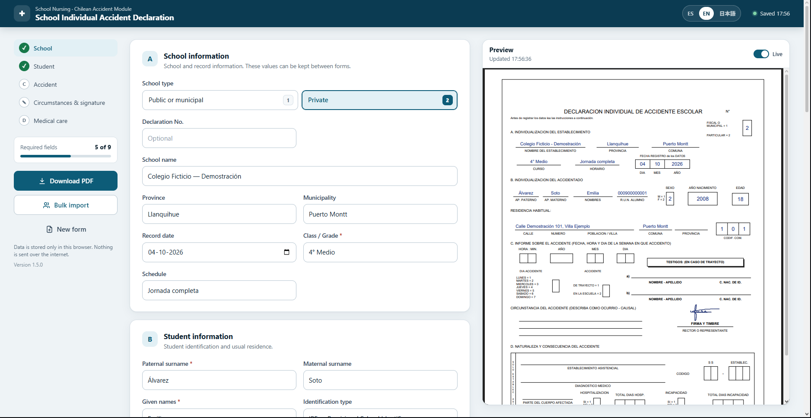
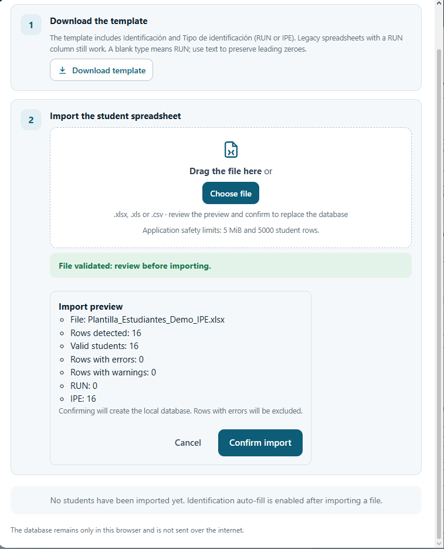
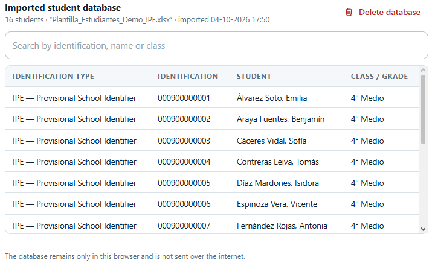
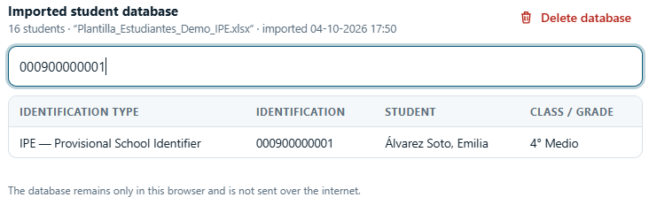
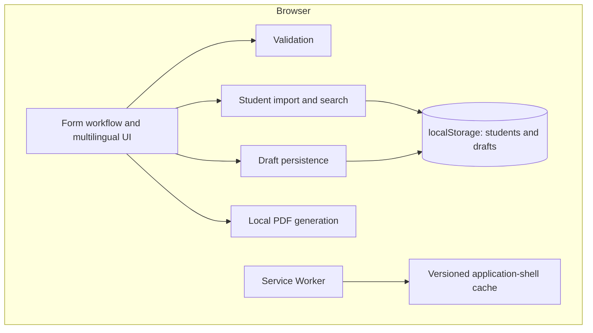

[English](README.md) | [Español](README_ES.md) | [日本語](README_JA.md)

# School Nursing System

A privacy-focused, offline-capable web application that assists with preparing Chilean School Accident Declarations. Forms, student records and PDF generation stay in the browser.

**JavaScript · HTML · CSS · PWA / Service Worker · jsPDF · SheetJS / XLSX**



## From a nursing-room workflow to a software project

The project began with a real operational need in a Chilean school nursing room: manually preparing accident declarations required repetitive data entry. A lightweight first version was created rapidly and improved through practical use.

The public portfolio version evolved with stronger validation, privacy safeguards, safer persistence and updates, spreadsheet previews, RUN/IPE support, ES/EN/JA localization and automated regression tests. The architecture remains browser-local because this workflow does not require an application backend.

## What it does

| Workflow | Capabilities |
| --- | --- |
| Prepare a declaration | Structured school, student and accident forms; calendar and identification validation; live preview; client-side PDF download; drawn or uploaded signatures. |
| Reuse student information | Local student database; Excel/CSV import preview; search by identification, name or class; student autofill. |
| Continue working locally | Debounced draft autosave, validated recovery, explicit multi-tab conflict choices, offline operation after shell installation and installable PWA behavior. |
| Work across languages and devices | Spanish by default, English and Japanese UI; responsive layout; associated validation messages, ARIA states and accessible status notifications. |

## Spreadsheet import and student lookup

**Select → Parse & validate → Preview → Confirm**

`.xlsx`, `.xls` and `.csv` files are processed in a local Web Worker. Selecting a file does **not** replace the existing database: the preview separates errors from warnings, excludes invalid rows and preserves RUN/IPE types. Confirmation replaces the database with valid records. Same-type duplicates explicitly keep the last valid row; values are not silently truncated. File, row and processing limits protect browser responsiveness.



After confirmation, search the local database and use identification-based autofill to reduce repeated entry. The screenshots show fictional IPE records; both RUN and IPE are supported.



<details>
<summary>Identification search example</summary>



</details>

See [import validation, limits and compatibility](docs/STUDENT_IMPORT.md) and the [spreadsheet template](plantillas/Plantilla_Estudiantes.xlsx).

## Privacy by design

Student and medical information is processed locally. There is no application backend or database server, and the application does not send student records to an application server. Imported records, drafts and locally stored signatures remain in browser storage; **Clear all local data** removes application data after confirmation.

The Service Worker caches versioned application-shell resources, not student records, drafts, signatures or generated PDFs. Screenshots and public examples use fictional demonstration data.

Local storage is not a security boundary or a backup: device access, browser storage policies and deployment security still matter. See [SECURITY.md](SECURITY.md).

## Multilingual interface, Spanish document

The UI supports **Spanish, English and Japanese**. The generated *Declaración Individual de Accidente Escolar* remains **Spanish** with its existing administrative labels and structure. Changing the UI language does not translate or redefine the Chilean document.

**PDF compatibility limitation:** an IPE is written into the existing **R.U.N. ALUMNO** field, without inventing an official field or changing its label. Available space can shorten an identifier; review the PDF and confirm acceptance with the receiving institution. Commune codes are preserved in the application, but the existing PDF has only three code cells.

## Architecture and engineering decisions



There is no application backend. Plain JavaScript and static hosting keep deployment small; bundled jsPDF and SheetJS enable local processing without a runtime CDN dependency. Spreadsheet support fits the existing school workflow, while client-side PDF generation avoids uploading document contents.

Integrity-checked, versioned shell installation helps prevent mixed application resources during updates. Existing clients are not forcibly switched to a new worker. Draft schema validation and explicit conflict choices reduce accidental replacement of local work. These choices fit this workflow rather than prescribing an architecture for every health application.

Recovery and lifecycle saves are best effort. Invalid or incomplete identifiers/dates can prevent an entire draft from recovering, and localStorage cannot make concurrent writes atomic. Details and update instructions: [PWA and draft persistence](docs/PWA.md).

## RUN and IPE compatibility

- **RUN:** Chilean format and check-digit validation remain in place.
- **IPE:** a separate application-level rule accepts 1–30 digits, preserves text leading zeroes and stores type/value separately. This is **not an official government IPE specification** and does not use RUN checksum validation.
- **Legacy spreadsheets:** RUN-only columns remain supported. Invalid RUNs are rejected and never automatically reinterpreted as IPE.

## Testing

The current regression suite has **49 passing tests**, covering form/date validation, RUN/IPE, CSV/XLS/XLSX import, drafts and recovery, multi-tab behavior, PWA cache/update behavior and Spanish PDF generation.

With Node.js installed, run from the repository root:

```sh
node --test tests/*.test.cjs
```

The dependency-free test harness does not replace browser layout, assistive-technology or installed-PWA checks. Manual checks are documented in [PWA.md](docs/PWA.md) and [STUDENT_IMPORT.md](docs/STUDENT_IMPORT.md).

## Getting started

```sh
git clone https://github.com/YoAndrew21/school-nursing-system.git
cd school-nursing-system
npx serve .
```

Open the localhost URL printed by the server. No application build step or backend is required; `npx serve` is a development-server option. Use HTTP on localhost for development and HTTPS for deployment. Opening `index.html` through `file://` is not the normal workflow and does not provide Service Worker behavior. Offline use requires successful shell installation first.

## Project structure

```text
school-nursing-system/
├── index.html              # Form and application entry point
├── css/                    # Responsive styles
├── js/                     # UI, validation, import, persistence and PDF
├── vendor/                 # Bundled jsPDF and SheetJS
├── plantillas/             # Student spreadsheet template
├── tests/                  # Regression suite
├── tools/                  # Template and release maintenance
├── docs/                   # Technical notes and localized screenshots
│   └── images/             # ES / EN / JA portfolio screenshots
├── sw.js                   # Application-shell caching
├── manifest.webmanifest    # PWA metadata
├── SECURITY.md
└── README*.md              # English, Spanish and Japanese documentation
```

## Safe contributions and scope

Never commit real student names, RUN/RUT/IPE values, addresses, medical information, signatures, school databases, credentials or secrets. Public examples, screenshots and issue reports must use fictional data. Follow the [security and privacy guidance](SECURITY.md).

This public-source portfolio project demonstrates a school-health administrative workflow. It is not an official Chilean government system and makes no medical or regulatory certification claim. Organizations adopting or adapting it must validate their operational, privacy and legal requirements. No project-wide open-source license is currently provided; do not assume redistribution rights from public visibility alone.

**Author:** Yordan Andres Chavez Barros · [YoAndrew21](https://github.com/YoAndrew21) · [Repository](https://github.com/YoAndrew21/school-nursing-system)
