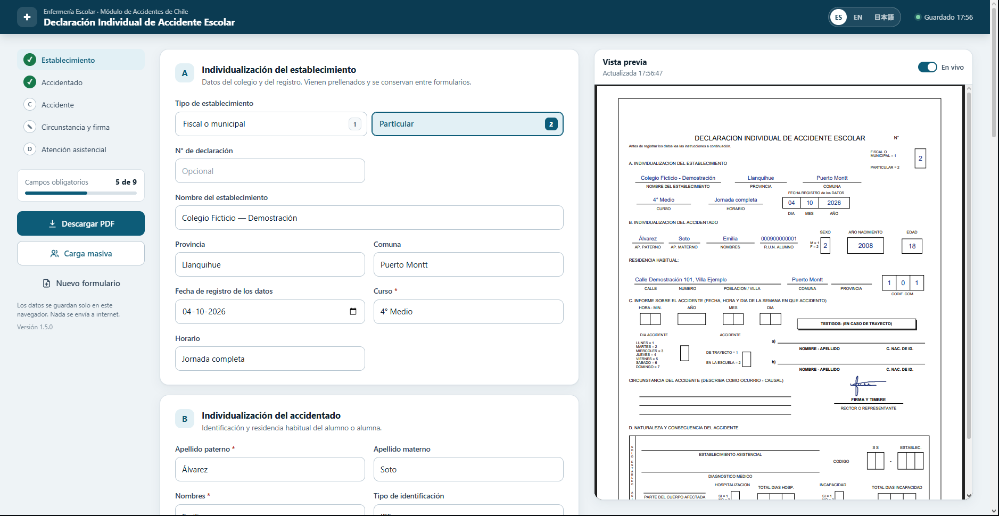
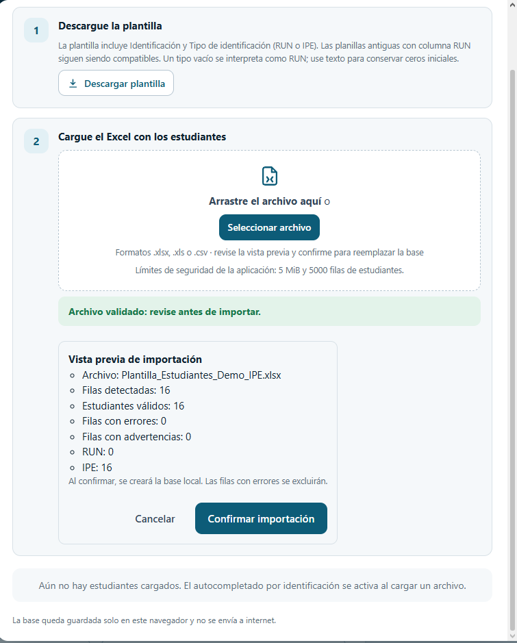
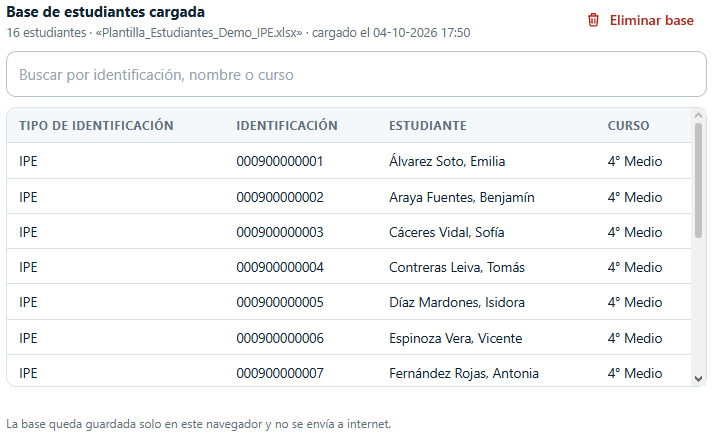
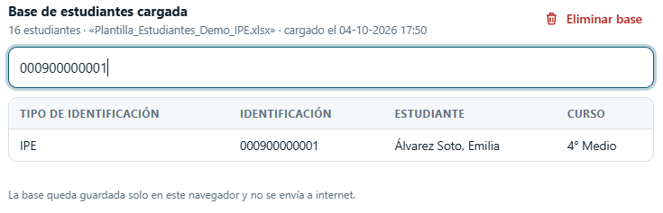
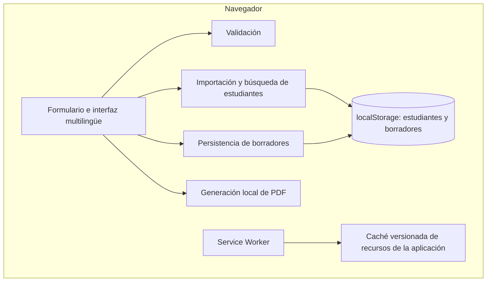

[English](README.md) | [Español](README_ES.md) | [日本語](README_JA.md)

# School Nursing System

Aplicación web centrada en la privacidad, con funcionamiento sin conexión, que facilita la preparación de la Declaración Individual de Accidente Escolar de Chile. El formulario, los registros de estudiantes y la generación de PDF se procesan en el navegador.

**JavaScript · HTML · CSS · PWA / Service Worker · jsPDF · SheetJS / XLSX**



## De una necesidad de enfermería a un proyecto de software

El proyecto nació de una necesidad real en una enfermería escolar chilena: preparar declaraciones de accidentes manualmente exigía repetir el ingreso de datos. Se creó una primera versión ligera con rapidez y se mejoró de forma iterativa a partir de su uso práctico.

La versión pública de portafolio incorporó validaciones más sólidas, medidas de privacidad, persistencia y actualizaciones más seguras, vista previa de importación, compatibilidad RUN/IPE, interfaz ES/EN/JA y pruebas de regresión. La arquitectura sigue siendo local porque este flujo no requiere un backend de aplicación.

## Funcionalidades principales

| Flujo | Capacidades |
| --- | --- |
| Preparar una declaración | Formulario estructurado de establecimiento, estudiante y accidente; validación de fechas e identificación; vista previa en vivo; descarga de PDF local; firma dibujada o cargada como imagen. |
| Reutilizar información | Base local de estudiantes; vista previa de importación Excel/CSV; búsqueda por identificación, nombre o curso; autocompletado. |
| Continuar trabajando localmente | Guardado automático diferido, recuperación validada, resolución explícita de conflictos entre pestañas, uso sin conexión tras instalar los recursos y PWA instalable. |
| Trabajar en distintos idiomas y dispositivos | Español predeterminado, inglés y japonés; diseño adaptable; mensajes asociados a campos, estados ARIA y notificaciones accesibles. |

## Importación de planillas y búsqueda de estudiantes

**Seleccionar → Analizar y validar → Revisar → Confirmar**

Los archivos `.xlsx`, `.xls` y `.csv` se procesan mediante un Web Worker local. Seleccionar un archivo **no** reemplaza la base existente: la vista previa distingue errores y advertencias, excluye filas inválidas y conserva los tipos RUN/IPE. La confirmación reemplaza la base con los registros válidos. Los duplicados del mismo tipo conservan explícitamente la última fila válida; los valores no se recortan silenciosamente. Los límites de archivo, filas y tiempo de procesamiento ayudan a mantener la respuesta del navegador.



Tras confirmar, la base local permite buscar estudiantes y completar el formulario por identificación. Las capturas muestran registros IPE ficticios; la aplicación admite tanto RUN como IPE.



<details>
<summary>Ejemplo de búsqueda por identificación</summary>



</details>

Consulte las [validaciones, límites y compatibilidad de importación](docs/STUDENT_IMPORT.md) y la [plantilla de estudiantes](plantillas/Plantilla_Estudiantes.xlsx).

## Privacidad desde el diseño

La información de estudiantes y los datos médicos se procesan localmente. No existe un backend de aplicación ni un servidor de base de datos, y la aplicación no envía registros de estudiantes a un servidor de aplicación. Los registros importados, borradores y firmas guardadas permanecen en el almacenamiento del navegador. **Eliminar todos los datos locales** permite borrarlos tras una confirmación.

El Service Worker guarda recursos versionados de la aplicación, no registros de estudiantes, borradores, firmas ni PDF generados. Las capturas y ejemplos públicos utilizan datos ficticios.

El almacenamiento local no constituye una barrera de seguridad ni un respaldo: siguen siendo relevantes el acceso al dispositivo, las políticas del navegador y la seguridad del despliegue. Consulte [SECURITY.md](SECURITY.md).

## Interfaz multilingüe, documento en español

La interfaz admite **español, inglés y japonés**. La *Declaración Individual de Accidente Escolar* generada permanece **en español**, con su estructura y terminología administrativa existentes. Cambiar el idioma de la interfaz no traduce ni redefine el documento chileno.

**Limitación de compatibilidad del PDF:** el IPE se escribe en el campo existente **R.U.N. ALUMNO**, sin crear un campo oficial ni modificar su etiqueta. El espacio disponible puede abreviar el identificador; revise el PDF y confirme su aceptación con la institución receptora. Los códigos de comuna se conservan en la aplicación, pero el PDF existente dispone de tres casillas para ese código.

## Arquitectura y decisiones de ingeniería



No hay backend de aplicación. JavaScript sin framework y alojamiento estático mantienen un despliegue sencillo; jsPDF y SheetJS incluidos localmente permiten procesar datos sin depender de un CDN durante el uso. Las planillas respetan una herramienta familiar en el colegio y la generación local de PDF evita subir el contenido de los documentos.

La instalación de recursos versionados con comprobación de integridad ayuda a evitar versiones mezcladas. Las pestañas existentes no cambian de Service Worker de forma forzada. La validación del esquema de borrador y las decisiones explícitas ante conflictos reducen reemplazos accidentales. Son decisiones apropiadas para este flujo, no una recomendación universal para aplicaciones de salud.

La recuperación y el guardado al abandonar la página se intentan sin garantizar que siempre se completen. Una identificación incompleta o inválida, o una fecha inválida, puede impedir recuperar todo el borrador; localStorage tampoco permite escrituras concurrentes atómicas. Consulte [PWA, persistencia y actualizaciones](docs/PWA.md).

## Compatibilidad RUN e IPE

- **RUN:** se mantiene la validación chilena de formato y dígito verificador.
- **IPE:** una regla independiente de la aplicación acepta entre 1 y 30 dígitos, conserva ceros iniciales en texto y almacena tipo y valor por separado. **No es una especificación oficial del Gobierno** y no utiliza el dígito verificador del RUN.
- **Planillas antiguas:** siguen siendo compatibles las columnas que solo contienen RUN. Un RUN inválido se rechaza y nunca se reinterpreta automáticamente como IPE.

## Pruebas

La suite actual contiene **49 pruebas aprobadas**: validación de formulario y fechas, RUN/IPE, importación CSV/XLS/XLSX, borradores y recuperación, comportamiento entre pestañas, caché y actualizaciones PWA, y generación de PDF en español.

Con Node.js instalado, ejecute desde la raíz del repositorio:

```sh
node --test tests/*.test.cjs
```

El entorno de pruebas sin dependencias adicionales no sustituye las comprobaciones visuales, con tecnologías de asistencia o de la PWA instalada. Las pruebas manuales se describen en [PWA.md](docs/PWA.md) y [STUDENT_IMPORT.md](docs/STUDENT_IMPORT.md).

## Primeros pasos

```sh
git clone https://github.com/YoAndrew21/school-nursing-system.git
cd school-nursing-system
npx serve .
```

Abra la URL localhost indicada por el servidor. No se necesita compilación de la aplicación ni backend; `npx serve` es una opción de servidor de desarrollo. Utilice HTTP en localhost para desarrollo y HTTPS al desplegar. Abrir `index.html` mediante `file://` no es el flujo normal y no habilita el Service Worker. El uso sin conexión requiere instalar previamente los recursos de la aplicación.

## Estructura del proyecto

```text
school-nursing-system/
├── index.html              # Formulario y punto de entrada
├── css/                    # Estilos adaptables
├── js/                     # Interfaz, validación, importación, persistencia y PDF
├── vendor/                 # jsPDF y SheetJS incluidos localmente
├── plantillas/             # Plantilla de estudiantes
├── tests/                  # Pruebas de regresión
├── tools/                  # Mantenimiento de plantilla y versiones
├── docs/                   # Notas técnicas y capturas por idioma
│   └── images/             # Capturas de portafolio ES / EN / JA
├── sw.js                   # Caché de recursos de la aplicación
├── manifest.webmanifest    # Metadatos PWA
├── SECURITY.md
└── README*.md              # Documentación EN, ES y JA
```

## Contribuciones seguras y alcance

Nunca incorpore al repositorio nombres reales de estudiantes, RUN/RUT/IPE reales, direcciones, información médica, firmas, bases escolares, credenciales ni secretos. Los ejemplos, capturas e informes públicos deben utilizar datos ficticios. Consulte la [guía de seguridad y privacidad](SECURITY.md).

Este proyecto de portafolio con código público demuestra un flujo administrativo de salud escolar. No es un sistema oficial del Gobierno de Chile ni declara certificación médica o regulatoria. Cada organización que lo adopte o adapte debe validar sus requisitos operativos, de privacidad y legales. Actualmente no hay una licencia general de código abierto; la publicación del código no implica por sí sola derechos de redistribución.

**Autor:** Yordan Andres Chavez Barros · [YoAndrew21](https://github.com/YoAndrew21) · [Repositorio](https://github.com/YoAndrew21/school-nursing-system)
