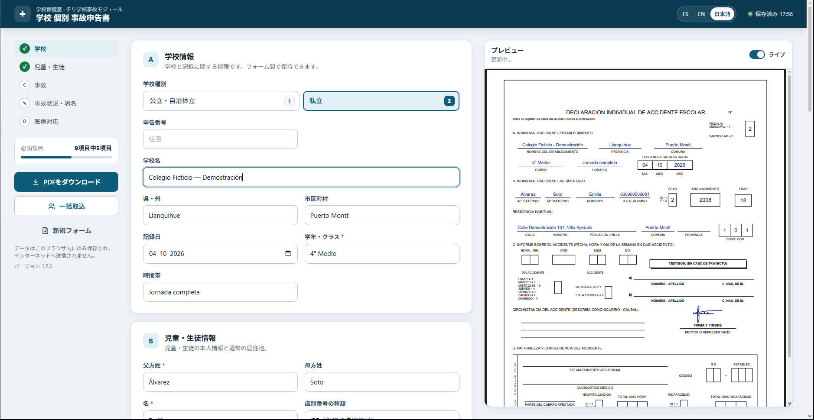
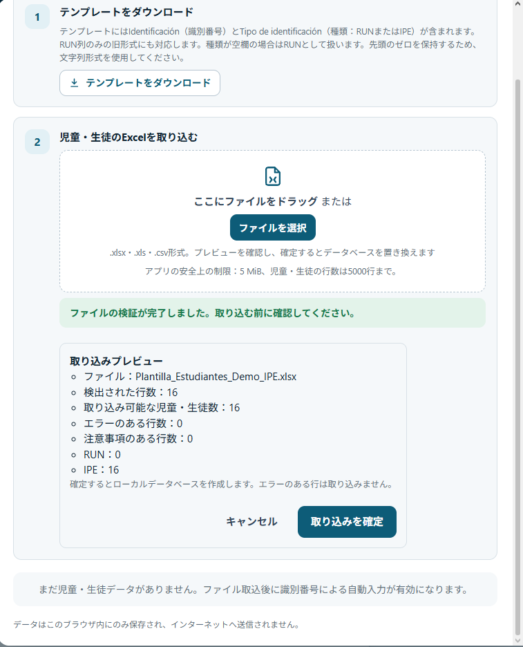
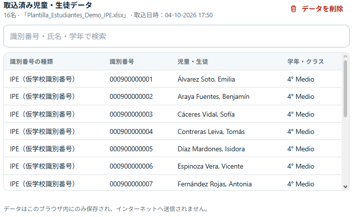
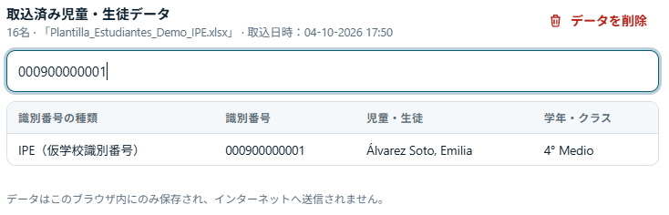
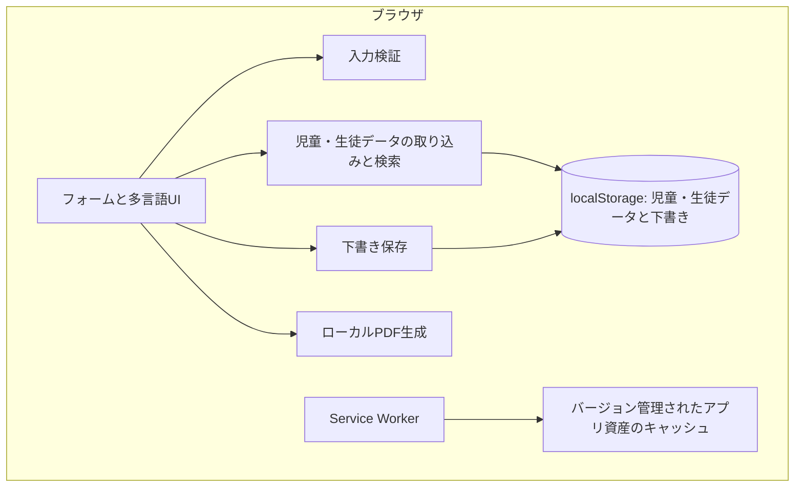

[English](README.md) | [Español](README_ES.md) | [日本語](README_JA.md)

# School Nursing System

チリの学校事故申告書の作成を支援する、プライバシーを重視したWebアプリケーションです。オフライン利用に対応し、フォーム、児童・生徒の記録、PDF生成をブラウザ内で処理します。

**JavaScript · HTML · CSS · PWA / Service Worker · jsPDF · SheetJS / XLSX**



## 学校保健室の課題から生まれたプロジェクト

チリの学校保健室で、事故申告書を手作業で作成する際に同じ情報を繰り返し入力していたことが開発のきっかけです。まず軽量な初期版を短期間で作成し、実際の業務で得た経験をもとに改善を重ねました。

公開ポートフォリオ版では、入力検証、プライバシーへの配慮、保存と更新の安全性、表計算ファイルの取り込みプレビュー、RUN/IPE対応、ES/EN/JAの多言語UI、回帰テストを拡充しました。この業務にアプリケーション用バックエンドは必要ないため、ブラウザ内で完結する構成を維持しています。

## 主な機能

| 業務 | 機能 |
| --- | --- |
| 事故申告書の作成 | 学校・児童生徒・事故情報の入力、日付と識別番号の検証、ライブプレビュー、ローカルでのPDF生成・ダウンロード、手書き署名と署名画像の取り込み。 |
| 情報の再利用 | ローカルの児童・生徒データ、Excel/CSV取り込みプレビュー、識別番号・氏名・学年での検索、自動入力。 |
| 作業の継続 | 入力後にまとめて自動保存、検証済み下書きの復元、タブ間の競合時に保持する内容を選択、アプリ資産のインストール後のオフライン利用、インストール可能なPWA。 |
| 多言語・複数端末への対応 | スペイン語を既定とし英語・日本語にも対応、レスポンシブUI、入力欄に関連付けた検証メッセージ、ARIA状態とアクセシブルな通知。 |

## 表計算ファイルの取り込みと検索

**選択 → 解析・検証 → プレビュー → 確定**

`.xlsx`、`.xls`、`.csv`をローカルのWeb Workerで処理します。ファイルを選択した時点では既存データを置き換えません。プレビューでエラーと注意事項を区別し、不正な行を除外してRUN/IPEの種類を保持します。確定後に有効な記録でデータを置き換えます。同じ種類の識別番号が重複する場合は最後の有効な行を採用し、その処理を明示します。値を黙って切り詰めることはありません。ファイルサイズ・行数・処理時間に上限を設け、ブラウザの応答性に配慮しています。



確定後はローカルデータを検索し、識別番号からフォームを自動入力できます。画像は架空のIPE記録を示していますが、RUNとIPEの両方に対応しています。



<details>
<summary>識別番号での検索例</summary>



</details>

詳細は[取り込みの検証・上限・互換性](docs/STUDENT_IMPORT.md)と[表計算テンプレート](plantillas/Plantilla_Estudiantes.xlsx)をご覧ください。

## プライバシーを考慮した設計

児童・生徒の情報と医療情報はローカルで処理します。アプリケーション用バックエンドやデータベースサーバーはなく、児童・生徒の記録をアプリケーションサーバーへ送信しません。取り込んだ記録、下書き、保存された署名はブラウザのストレージに保持します。「すべてのローカルデータを削除」で確認後に削除できます。

Service Workerがキャッシュするのはバージョン管理されたアプリ資産です。児童・生徒の記録、下書き、署名、生成されたPDFはキャッシュしません。スクリーンショットと公開例には架空のデモ用データを使用しています。

ローカル保存はセキュリティ境界やバックアップではありません。端末へのアクセス、ブラウザの保存ポリシー、配信環境の安全性も考慮する必要があります。[SECURITY.md](SECURITY.md)をご確認ください。

## 多言語UIとスペイン語の申告書

UIは**スペイン語・英語・日本語**に対応しています。一方、生成する *Declaración Individual de Accidente Escolar* は、既存の構成と行政用語を維持した**スペイン語の文書**です。UIの言語変更によってチリの申告書を翻訳したり、定義し直したりすることはありません。

**PDFの互換性上の制約：** IPEは既存の **R.U.N. ALUMNO** 欄に記載します。公式欄を新設したり、表記を変更したりしません。欄の幅によって識別番号が省略される場合があるため、PDFを確認し、受領機関に使用可否を確認してください。市区町村コードはアプリ内では保持しますが、既存PDFのコード欄は3桁分です。

## アーキテクチャと技術的な判断



アプリケーション用バックエンドはありません。フレームワークを導入せずJavaScriptと静的配信を採用し、構成を小さく保っています。同梱したjsPDFとSheetJSにより、実行時にCDNへ依存せず処理できます。表計算ファイルは学校で使い慣れた業務との接点になり、PDFのローカル生成は文書内容のアップロードを不要にします。

整合性を確認したバージョン単位のインストールにより、異なる版のアプリ資産が混在するリスクを減らします。既存タブのService Workerは強制的に切り替えません。下書きスキーマの検証と競合時の選択によって、作業内容の意図しない置き換えを減らしています。すべての医療関連アプリに最適と主張するのではなく、この業務に適した判断です。

下書き復元とページを離れる際の保存は、必ず成功するとは限りません。不完全・不正な識別番号や不正な日付があると、下書き全体を復元できない場合があります。また、localStorageでは複数タブの書き込みを原子的に実行できません。詳細は[PWA・下書き保存・更新](docs/PWA.md)をご覧ください。

## RUNとIPEの互換性

- **RUN：** チリのRUN形式と検査数字の検証を維持しています。
- **IPE：** 独立したアプリ側のルールで1〜30桁の数字を受け付け、文字列の先頭のゼロを保持し、種類と値を分けて保存します。**政府の公式IPE仕様ではありません。** RUNの検査数字は適用しません。
- **既存の表計算ファイル：** RUN列だけの従来形式にも対応しています。不正なRUNは拒否し、自動的にIPEとして扱うことはありません。

## テスト

現在の回帰テストは**49件すべて成功**しています。フォーム・日付検証、RUN/IPE、CSV/XLS/XLSX取り込み、下書き保存と復元、タブ間の動作、PWAのキャッシュと更新、スペイン語PDF生成を確認します。

Node.jsを用意し、リポジトリのルートから実行してください。

```sh
node --test tests/*.test.cjs
```

追加依存関係のないテスト環境は、ブラウザの表示、支援技術、インストールしたPWAの確認に代わるものではありません。手動確認は[PWA.md](docs/PWA.md)と[STUDENT_IMPORT.md](docs/STUDENT_IMPORT.md)に記載しています。

## 起動方法

```sh
git clone https://github.com/YoAndrew21/school-nursing-system.git
cd school-nursing-system
npx serve .
```

サーバーが表示するlocalhostのURLを開きます。アプリのビルドやバックエンドは不要です。`npx serve`は開発用サーバーの選択肢の一つです。開発時はlocalhostのHTTP、公開時はHTTPSを使用してください。`file://`で`index.html`を直接開く方法は通常の利用方法ではなく、Service Workerは動作しません。オフライン利用には、先にアプリ資産を正常にインストールする必要があります。

## プロジェクト構成

```text
school-nursing-system/
├── index.html              # フォームとアプリの入口
├── css/                    # レスポンシブスタイル
├── js/                     # UI・検証・取り込み・保存・PDF
├── vendor/                 # 同梱したjsPDFとSheetJS
├── plantillas/             # 児童・生徒データのテンプレート
├── tests/                  # 回帰テスト
├── tools/                  # テンプレートとリリースの保守
├── docs/                   # 技術資料と言語別スクリーンショット
│   └── images/             # ES / EN / JAのポートフォリオ画像
├── sw.js                   # アプリ資産のキャッシュ
├── manifest.webmanifest    # PWAメタデータ
├── SECURITY.md
└── README*.md              # 英語・スペイン語・日本語の説明
```

## 安全な開発とプロジェクトの範囲

実在する児童・生徒の氏名、RUN/RUT/IPE、住所、医療情報、署名、学校のデータベース、認証情報や秘密情報をコミットしないでください。公開例、スクリーンショット、不具合報告には架空のデータを使用してください。[セキュリティとプライバシーの方針](SECURITY.md)をご確認ください。

公開ソースのポートフォリオとして、学校保健の事務業務を示すプロジェクトです。チリ政府の公式システムではなく、医療・規制上の認証を主張するものでもありません。採用・改変する組織は、運用、プライバシー、法的要件を確認する責任があります。現在、プロジェクト全体のオープンソースライセンスはありません。コードが公開されていることだけで再配布の権利があるとは判断しないでください。

**作者：** Yordan Andres Chavez Barros · [YoAndrew21](https://github.com/YoAndrew21) · [リポジトリ](https://github.com/YoAndrew21/school-nursing-system)
